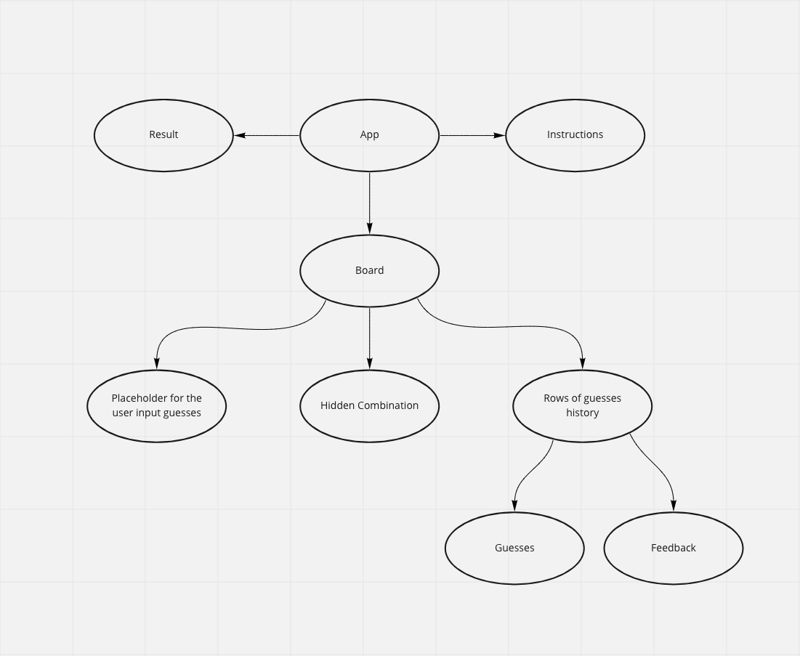

# Mastermind
This code cracking game is based on the board game Mastermind

# Table of Contents
1. [Run and Build](#run-and-build)
2. [Thought Process](#thought-process)
3. [Components](#components)
4. [Some Exmaple Flows](#some-example-flows)

# Run and Build
Prerequisite:
- Node.js
- NPM

The app is created using:
- Nodejs v17.3.0
- NPM v8.3.0

To build the app run the following step:
1. Clone the repo
```
git clone https://github.com/swcwsncyt/mastermind.git
```
2. Go the the directory
```
cd mastermind
```
3. Install dependencies
```
npm install
```
4. Start server
```
npm start
```
App should open a new tab on browser automatically at localhost:3000<br>
<br>

[Back to Top](#mastermind)

# Thought Process
Requirements: 
1. Ability to guess a combination
2. View history of guesses and their feedback
3. Number of guesses remaining
4. Generate the numbers from Random generator API

Extensions:
1. Ability to choose between Normal and Extreme mode
2. Styling UI to imitate a terminal


> After listing out the requirement and extensions I wanted to attempt. I decided to create a structure map to brainstorm what components I might need and create the base frame of the app.



> Then I categorized functionalities of the app into 4 main parts:
> 1. Board and game rules/logics
>    - Display history of guesses
>    - Display history of feedback
> 2. Placeholder for user input
>    - User input validation (should address most of the edge cases)
>    - Check input against the game rules
> 3. Instructions/ Game Mode
>    - Display game rules
>    - Change difficulty levels
> 4. Result
>    - If winning or losing, stop the game, and give option to start a new game

Board and Guesses
> The board is going to store all of the history of guesses and feedback and there is limited numbers of guesses.<br/>
> Therefore, I think a 2D matrix would be the best structure.<br/>
> Row will be limiting the numbers of guesses, and column will be the length of the combinations.

Feedback logic
> Before generating the feedback, there are some rules to bear in mind: 
> 1. Duplicate is allowed, so if the final answer contains duplicate and the guess only contains one number, it should only show feedback for the one number. (Example: Answer is 1123, Guess is 0123, It should show 3 numbers are in correct location only)
> 2. Feedback should not reveal which number is a correct guess
>
> In order to generate the feedback, I decided to show the feedback in this order:
> 1. Show all of the feedbacks for correct number and location
> 2. Show all of the feedbacks for correct number but wrong location

End Game Logic
> Winning:
> - It can occurs on any guesses
>
> Losing: 
> - Only occurs on the last guesses
> 
> With this in mind, I decided to run this end game validation logic on every guesses, and only run the losing logic on the last guess. 

Start A New Game Logic
> There are 2 scenarios that needed to reset the game
> 1. Changing the game mode
> 2. Game ended
> 
> For the structure I intially created, there are 2 components needed to be reset
> 1. Result
> 2. Board

Test Cases
> There are several test cases needed to be checked to ensure the functionality of the app
> Game Logic
> 1. Guess both correct and incorrect combination besides the last guess (ensure the end game check is functioning)
> 2. Guess both correct and incorrect combination on the last guess (ensure the end game check treat the last guess with a different logic)
> 3. Guess a combination with numbers on both correct and incorrect location (ensure the feedback is reflecting correctly)
> 4. Guess a combination with one of the duplicated number (ensure 1 number will not reflect on feedback twice)
> 5. Guess a combination with both/multiple duplicated number (ensure all duplicated number will reflect on feedback)
> 
> Result
> 1. Click the start new game should empty the board and generate a new random answer
> 
> Game mode
> 1. Click on the Normal or Extreme mode should empty the board and generate a new random answer
> 2. Mode change when there is entry on the board should also empty board and generate a new random answer

[Back to Top](#mastermind)

# Components

App.js
> Children:
> 1. Board
> 2. Instructions
> 3. Result

> States:
> 1. boardSize 
>    - an Array with the format **[row, column]** / **[numbers of guesses allowed, combination size]**
>    - default [10, 4]
> 2. gameover
>    - boolean
>    - default **false**
>    - A flag to toggle the result popup, show/hide input box, show/hide answer
> 3. result
>    - string
>    - default **won**
>    - To determind end game phrase on the result pop up
> 4. reset
>    - boolean
>    - default **false**
>    - A flag to trigger reset of the game in both App and Board

Board.js
> Children:
> 1. Answer
> 2. GuessRow
> 3. GuessInput

> States:
> 1. answer 
>    - an Array with the format **[1st, 2nd, 3rd, 4th number in combination]**
>    - default **[]** update after API call to random generator
> 2. board
>    - an 2D Array
>    - default **[[]]** update according to the props **boardSize** from parent App.js with empty string filled
>    - A flag to toggle the result popup, show/hide input box, show/hide answer
> 3. guessCount
>    - string
>    - default **0** update according to the props **boardSize** from parent App.js
>    - To determind end game phrase on the result pop up
> 
> This will render a table to hold the answer combination (table head), history of guesses (row), User input boxes (last row)

Instructions.js
> This will render a div including instructions of the game and the Game mode button

Result.js
> This will only render a popup div on top when gameover is set to true, it contains a button to start a new game

Answer.js
> This will contain the answer combination, show/hide toggle is determinded by a passed in props gameover state from App.js

GuessRow.js
> Children:
> 1. Combination
> 2. Feedback

> This will render the row in the Board.js table, with 2 column guessed combination and its feedback. This also hold the style list generating logic for display feedback

GuessInput.js
> State:
> 1. input
>    - Array [**value1, value2, value3, value4]** value from corresponding input box
>    - default ["", "", "", ""]

> This render a form that contains 4 inputs boxes for user input combination guess

Combination.js
> This will render one number from the combination using the num props passed in from parent GuessRow.js

Feedback.js
> This will render one feedback using the style and val props passed in from parent GuessRow.js

[Back to Top](#mastermind)

# Some Example Flows
User enter a combination (make a guess)
> 1. GuessInput onSubmit
>    - validate input
>    - invoke method passed from parent to store the combination
>    - reset the user input
>    - focus back to the first input box 
> 2. Board (parent)
>    - update the row from the bottom (trigger a rerender for the row)
>    - deduct a guess count
>    - check if the combination is correct
> 3. GuessRow 
>    - generate new style list for feedback
>    - rerender Combination and Feedback

Additional flow when combination is correct
> 1. Board
>    - invoke a method passed from parent to change the gameover flag to true
> 2. App
>    - when gameover is true, Result will be rendered
> 3. Result
>    - default result is set as won
>    - won message will be displayed

User click on game mode
> 1. Instructions
>    - invoke method passed from parent to change the boardSize
> 2. App
>    - pass new boardSize to Board
> 3. Board
>    - change in boardSize trigger generate a new empty board and reset guessCount
>    - trigger GuessRow to rerender

[Back to Top](#mastermind)